# The Gauntlet

The Album Gauntlet is a part of my approach for appreciating music:  a series of playlists that are used as a kanban board, where every column represents a number of listens to a record.  The goal is to listen to each record five times.

You can learn more about The Album Gauntlet [here](https://blog.joewoods.dev/music/the-album-gauntlet-over-engineered-music-appreciation/).

This is a web app to help you manage your own gauntlet.  There's no database; it's backed entirely by Spotify playlists.

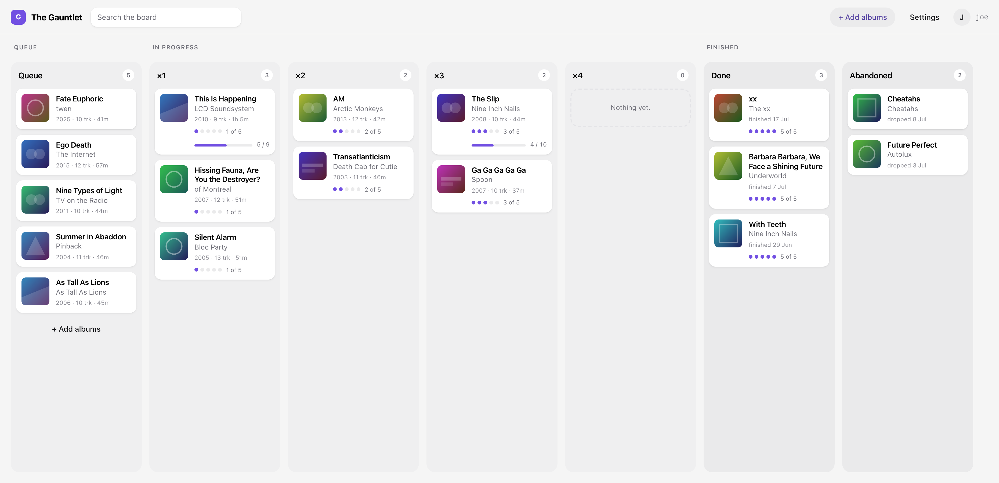

When you finish an album, it's automatically advanced to the next column.

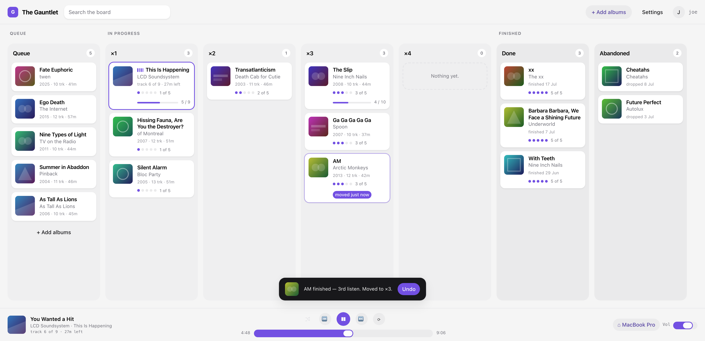

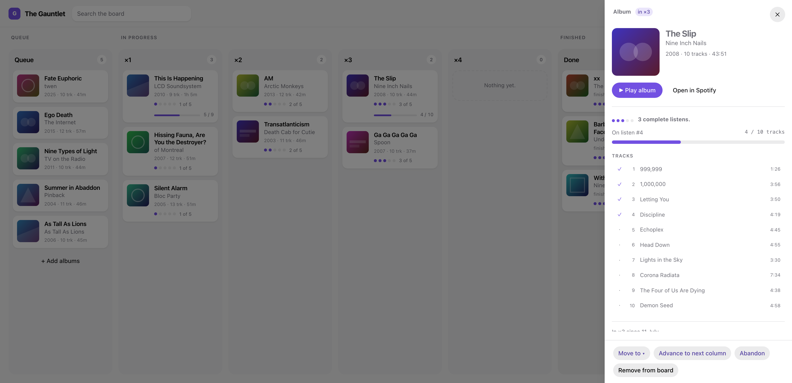

There's other tools to manage your albums, like being able to pick albums from tracks on a playlist, or from your most-listened songs.

<details>
<summary>More screenshots</summary>

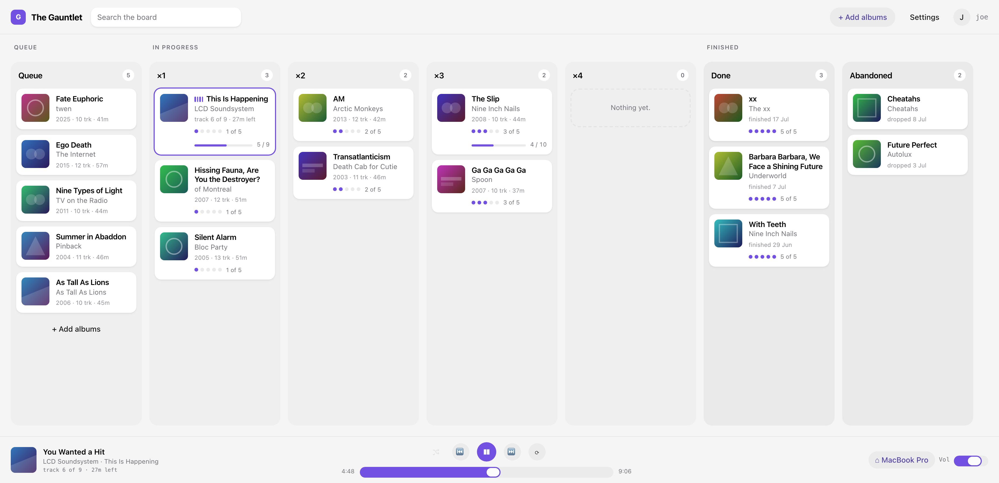

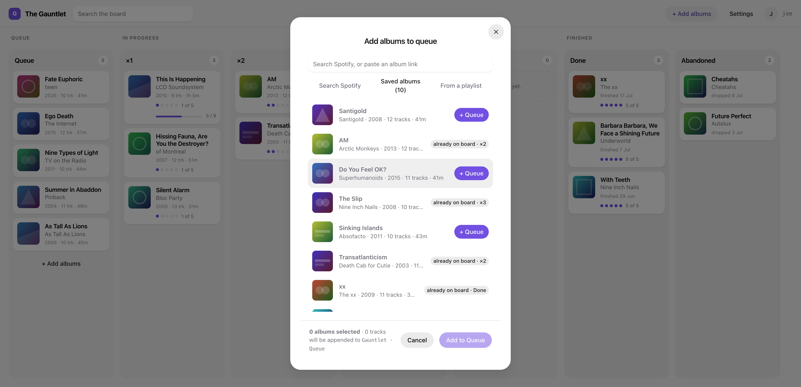

**Dark** — it follows whatever the machine is set to. Settings holds the override, for a
machine that's set to one and a listener who wants the other.

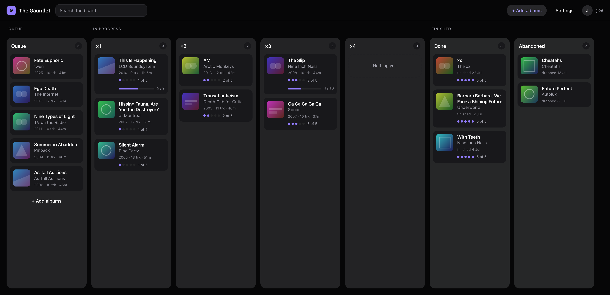

**First records** — what to queue, ranked from songs you already know.

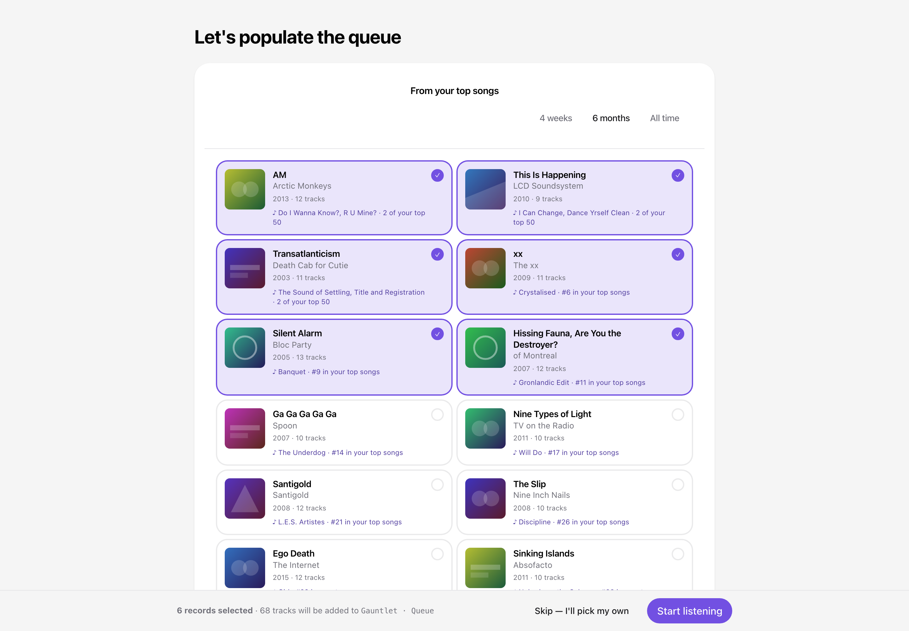

**On a phone** — the board collapses to one column at a time.

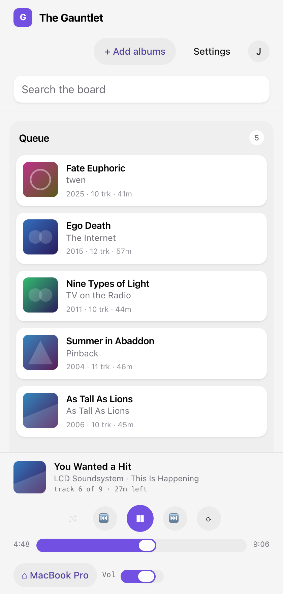

**Log in** — one button, and what it will ask Spotify for.

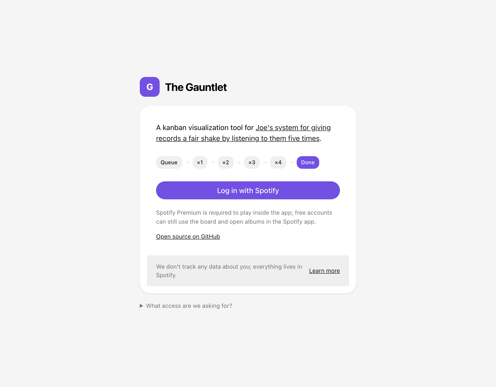

**Setup** — creates the seven playlists, named exactly.

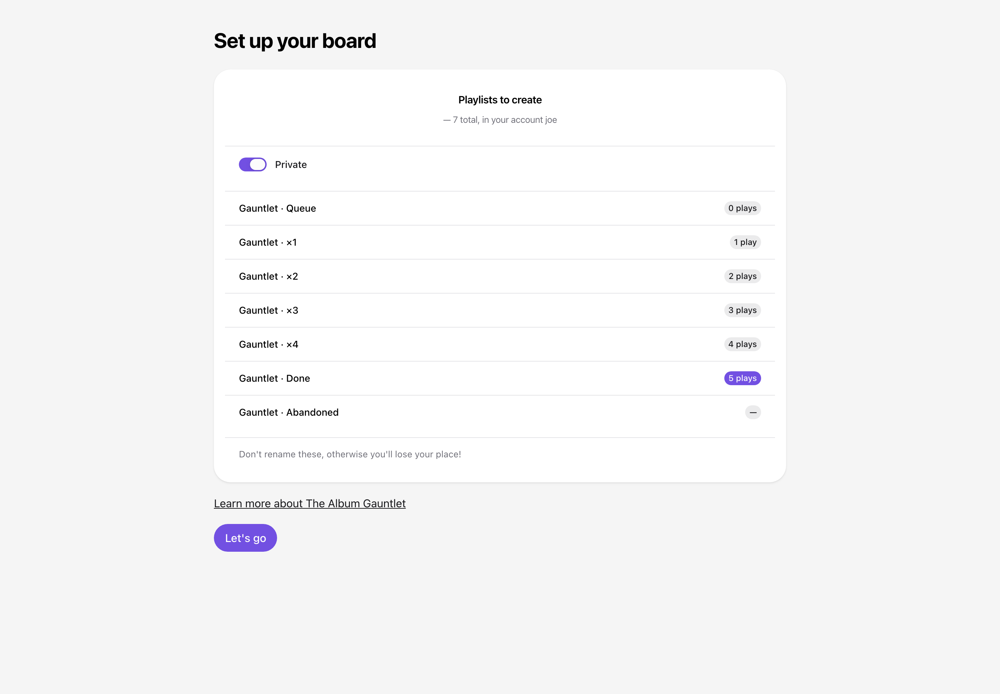

**Settings** — an account, seven playlists, and which theme to draw them in.

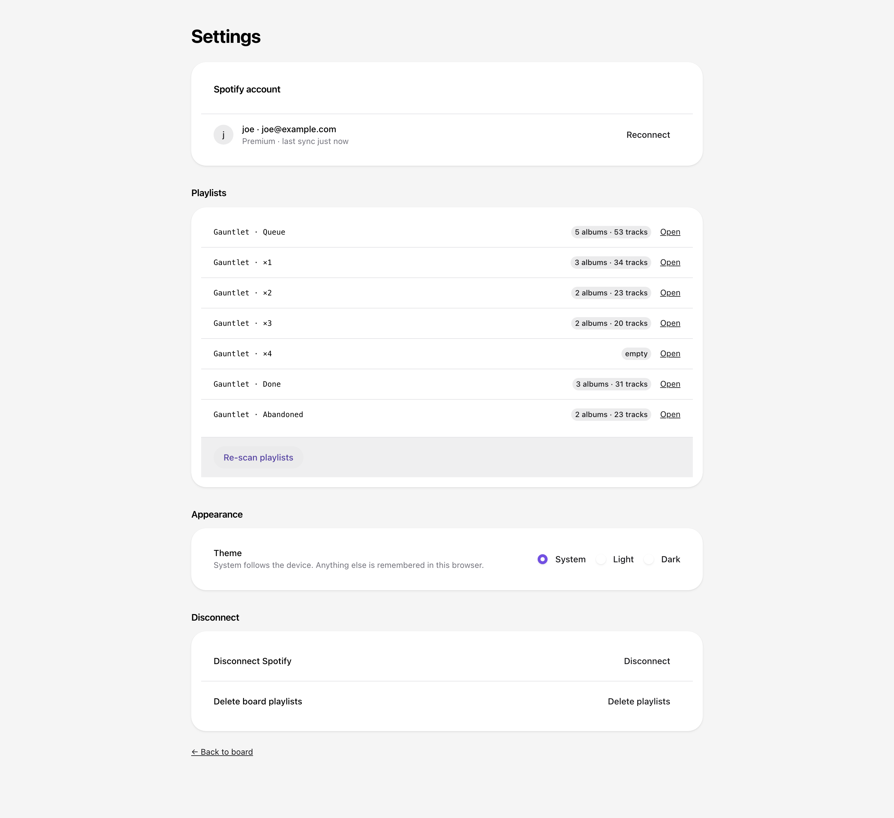

</details>

Unfortunately, due to limitations with the Spotify API, if you want to use it, you're going to have to host your own; Spotify limits integrations to five users, unless you're applying for increased limits as an organization.

## Deploy your own

One option for running this is to deploy it to a cloud provider, like Vercel.  You don't have to do this, though; skip ahead if you just want to run it locally.

You need a Spotify **Premium** account and a [Vercel](https://vercel.com) account. Since February
2026 the owner of a development-mode app must hold an active Premium subscription; if it lapses,
the app stops working.

### 1. Create the Spotify app

1. [Developer dashboard](https://developer.spotify.com/dashboard) → **Create app**. Name and
   description: anything.
2. **Redirect URI** — `http://127.0.0.1:3434/api/auth/callback/spotify`, then **Add**. Spotify
   rejects `localhost`, so the loopback IP has to be named literally.
3. **Which API/SDKs** — tick **Web API** and **Web Playback SDK**. Accept the terms and **Save**.
4. Open the app → **Settings**, and copy the **Client ID** and the **client secret**.
5. **Settings → User Management** → add the email on *your own* Spotify account.

Step 5 is the one that costs an hour when skipped. A new app is in development mode, where only
accounts listed under User Management may use the API — the owner's included. Nothing announces
this at sign-in; the refusal arrives later as a bare `403 Forbidden`.

### 2. Deploy to Vercel

Push this repository to your own GitHub, GitLab or Bitbucket account, then **Add New → Project** in
Vercel and import it. Next.js is detected — leave the build settings alone. Expand **Environment
Variables** and add three:

| Name | Value |
|---|---|
| `AUTH_SPOTIFY_ID` | the Client ID from step 1 |
| `AUTH_SPOTIFY_SECRET` | the client secret from step 1 |
| `AUTH_SECRET` | any random string — `npx auth secret` prints one |

**Deploy**, then copy the production domain. There is nothing else to provision: no database, no
add-ons, no storage.

### 3. Point both ends at that domain

1. Vercel → **Settings → Environment Variables** → add `APP_ORIGIN` =
   `https://your-project.vercel.app`.
2. Spotify → **Settings → Edit → Redirect URIs** → add
   `https://your-project.vercel.app/api/auth/callback/spotify` → **Add** → **Save**.
3. Vercel → **Deployments** → the newest → **Redeploy**. Environment variable changes only reach
   new deployments.

`APP_ORIGIN` pins the OAuth handshake to one origin, which is why a single redirect URI covers the
deployment however it's reached. Don't set `AUTH_URL` as well — the reasoning is in
[`src/lib/auth/request.ts`](src/lib/auth/request.ts). On a custom domain, add it in Vercel first and
use it for both values above.

### 4. Add your listeners

Spotify → **Settings → User Management → Add new user**, using the email on each person's Spotify
account. Five in total, **including your own**. An account that isn't listed is refused by Spotify,
as `AccessDenied` at the consent screen or `403 Forbidden` later;
`GET /api/diagnostics/account` reports what a session actually holds.

Playback in the browser needs Premium. Free accounts get the board and an "Open in Spotify" path.

### 5. Sign in, then check one thing

Sign in, let Setup create the seven playlists, play a few tracks, then open
`/api/diagnostics/played-at`.

Spotify documents `played_at` only as "the date and time the track was played", without saying
whether that marks the start or the end of the track — and the difference decides whether a skipped
track counts. The app assumes **end**, as a setting rather than an assumption baked in, and this
route reports which reading the gaps in your own history actually fit:

```json
{ "configured": "end", "bestFit": "end", "agrees": true, "sampleSize": 11, "meanErrorMs": { … } }
```

If `agrees` is `false`, add `PLAYED_AT_SEMANTICS=start` to your environment variables and redeploy.
If `bestFit` is `null` there wasn't a contiguous run long enough to judge — play a record through
and try again. It's the only optional variable; the other four are in steps 2 and 3.

Getting this wrong under-credits rather than over-credits: a card that should have moved doesn't,
and *Advance to next column* in the album drawer fixes it by hand.

## Run it locally

Do step 1 above, then:

```sh
pnpm install
cp .env.example .env.local     # the same values; leave APP_ORIGIN as it comes
pnpm dev                       # http://127.0.0.1:3434
```

Open `127.0.0.1:3434`, not `localhost:3434`. They are the same server on different origins, and
starting the handshake on one while the callback lands on the other drops the PKCE cookie.

Finally, do step 4 above and add yourself as a listener.

## When it doesn't work

| Symptom | Cause |
|---|---|
| `403 Forbidden` creating the playlists | The account isn't under User Management, or a scope was added after that account last consented. `GET /api/diagnostics/account` tells the two apart. |
| `InvalidCheck: pkceCodeVerifier value could not be parsed` | The browser is on a different origin from `APP_ORIGIN`. Locally that means `localhost` instead of `127.0.0.1`. |
| `INVALID_CLIENT: Invalid redirect URI` | The registered URI doesn't match exactly. Scheme, host, port and path all count. |
| Cards never advance | Check `/api/diagnostics/played-at` (step 5). `recently-played` also only holds 50 items, so passes older than that have fallen out of history. |

Every Spotify refusal is logged server-side with its status, endpoint and body — on Vercel, in the
function logs.
